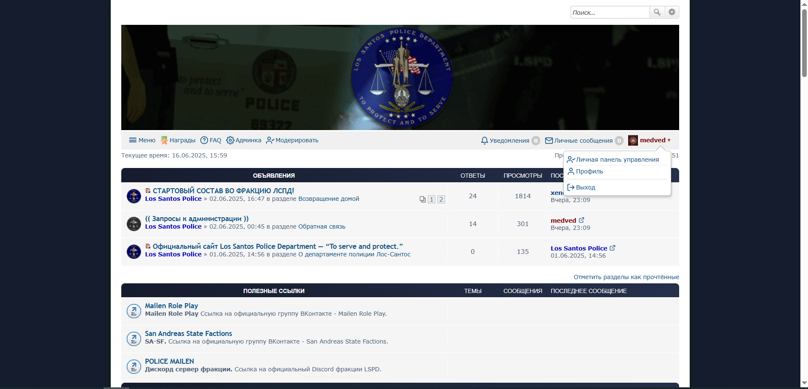

# Модифицированная тема prosilverex

Кастомизированная версия темы ProsilverEx для форумов phpBBex версии 2.0.4 (для версий phpBB на базе 3.1.9) с акцентом на минималистичный дизайн. Данный стиль включает в себя обновление классических иконок в основных представлениях и легкие косметические изменения при сохранении основной функциональности оригинальной темы.

## Рекомендуемые расширения

Для оптимальной работы форума рекомендуются следующие расширения:

| Название расширения | Версия | Описание |
|---------------|---------|-------------|
| @Mention System | 1.0.0 | Система упоминаний пользователей |
| Board Announcements | 1.0.6 | Система объявлений форума |
| Medals System | 1.0.1 | Система медалей и наград |
| phpBBext | 1.0.0 | Дополнительный функционал phpBB |
| Quick Login | 1.0.5 | Быстрая форма входа |
| Topic Preview | - | Предварительный просмотр тем |

## Примечание

Это персональная модификация темы prosilverex с упором на визуальные улучшения. Несмотря на стремление к качеству, возможны некоторые незначительные несоответствия в дизайне. Тема предоставляется "как есть" и в первую очередь направлена на создание более приятной визуальной альтернативы оригинальной теме.

## Установка

1. Скачать папку prosilver_ex
2. Загрузить в директорию `styles` форума phpBB (можно изменить название папки)
3. Установить стиль через ACP
4. Активировать стиль во вкладке **Персонализация > Стили**

## Лицензия

Эта тема основана на prosilverex и следует условиям её оригинальной лицензии. 
